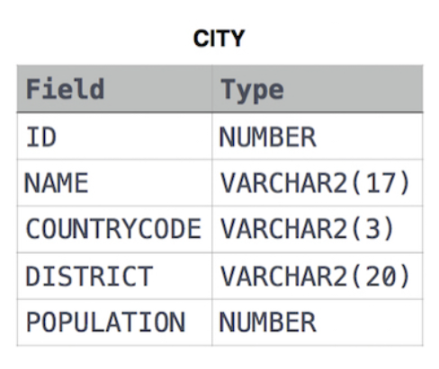

## DATA MANIPULATION LANGUAGE (DML)

Es un subconjunto de comandos para manipular la base de datos.

Los comandos que comprende son:

- `SELECT`, `FROM`, `WHERE`, `JOINs`, `GROUP BY`, `ORDER BY`, `HAVING`, `INSERT`, `UPDATE` y `DELETE`.

### SELECT + FROM:
Con este comando se utiliza para recuperar datos de una o más tablas junto con `FROM`.

Ejemplo:



- Queremos recuperar los datos de la tabla `CITY`.

```sql
SELECT *
FROM CITY;
-- Lo que estamos haciendo es recuperar todos los datos de la tabla.
```

Es como decir seleccionar  todos los datos de la tabla city.


### WHERE:
Se utiliza para filtrar registros específicos.

Ejemplo:

- Queremos filtrar los datos de la tabla `CITY` donde `POPULATION` sea mayor a 100000.

```sql
SELECT *
FROM CITY
WHERE POPULATION > 100000;
-- Filtrará todos los datos donde la población sea mayor a diez mil.
```

### GROUP BY:
Sirve para agrupar filas que tiene valores comunes en columnas especificadas.

Ejemplo:

- Queremos agrupa las filas por el código de país o `COUNTRYCODE`.

```sql
SELECT COUNTRYCODE
FROM CITY
GROUP BY COUNTRYCODE;
-- ESTAMOS AGRUPANDO LAS FILAS POR EL CÓDIGO DE PAÍS EJEMPLO 'USA', 'JPN', ETC.
```

### ORDER BY:
Sirve para ordenar los registros o filas de manera ascendente(por defecto) o descendente.

Ejemplo:

- Queremos ordenar los datos pero por nombre de ciudad, de manera ascendente y luego lo hacemos de manera descendente.

```sql
SELECT *
FROM CITY
ORDER BY name;
-- Aquí ordenamos de manera ascendente por el nombre y por defecto
```

```sql
SELECT *
FROM CITY
ORDER BY ASC name;
-- Aquí estamos ordenando de manera ascendente pero usando ASC
```

```sql
SELECT *
FROM CITY
ORDER BY DESC name;
-- Aquí estamos ordenando de manera descendente con la palabra clave DESC
```

### HAVING
Se usa jutamente con `GROUP BY` para agrupar y filtrar por una condición luego de aplicar una función de agregación.

Ejemplo: 

- Queremos agrupar los datos por `COUNTRYCODE` para luego filtrarlos mientras el promedio de `POPULATION` sea mayor a 1000000.

```sql
SELECT COUNTRYCODE, AVG(POPULATION)
FROM CITY
GROUP BY COUNTRYCODE
HAVING AVG(POPULATION);
```

### UPDATE:
Así como usamos alter para alterar o añadir campos ya existentes, `UPDATE` actualiza los registros ya existentes.

Ejemplo:

- Queremos ACTUALIZAR el registro `POPULATION` a 134966 de la tabla `CITY` donde `NAME` sea = a 'Corona'.

```sql
UPDATE CITY
SET POPULATION = 134966
WHERE NAME = 'Corona';
```


### INSERT: 
Con este comando podemos insertar datos dentro de una tabla, no es un comando DDL pero vamos a verlo.

Para hacerlo hacemos uso de:
```sql
INSERT INTO personajes VALUES
(1, "Naruto"),
(2, "Sasuke"),
(3, "Itachi");
```