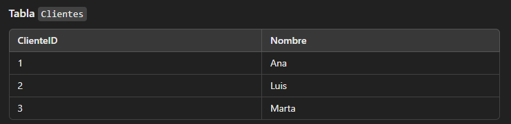
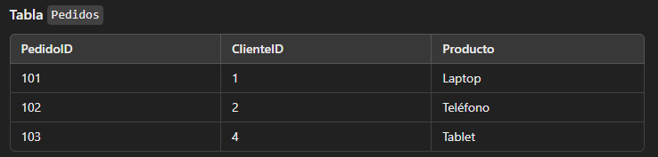
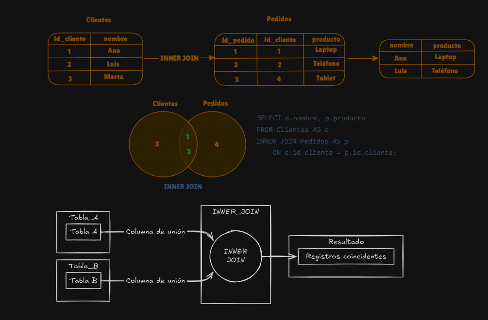
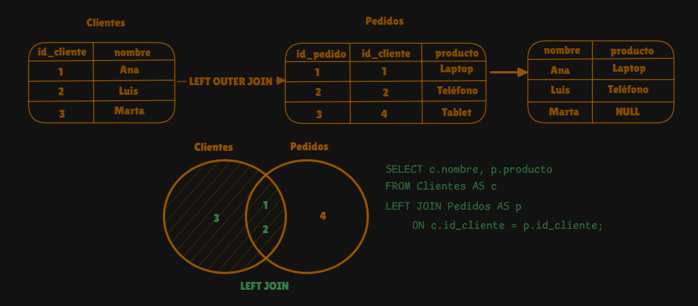
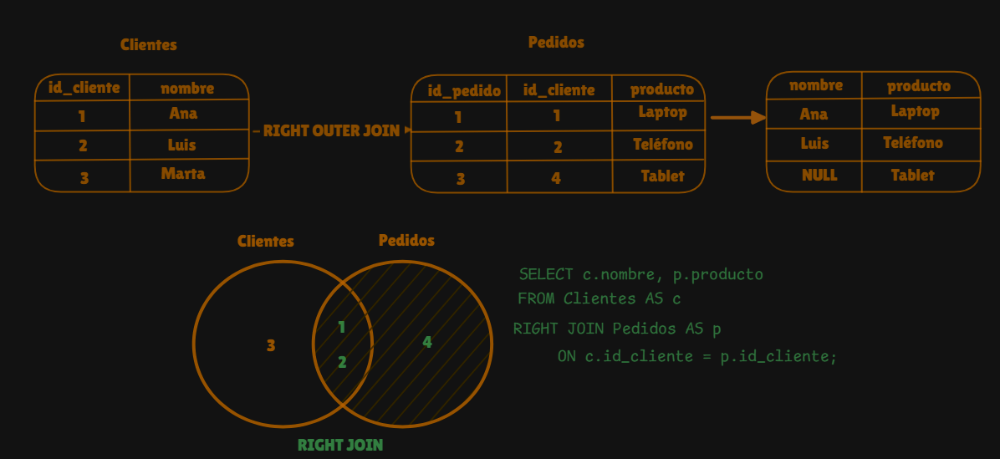
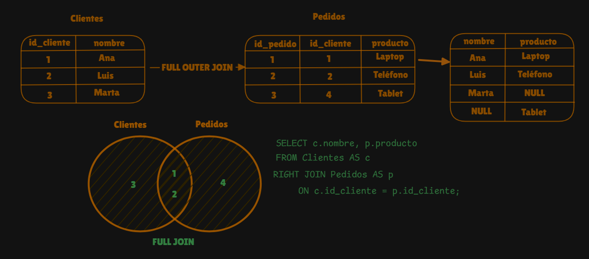

# JOINs

- Son las uniones de dos o más tablas en una sola tabla en base a una condición.

### INNER JOIN:
Devuelve los valores o filas que coinciden en ambas tablas.

Ejemplo:

- Hacemos una query donde vamos a selecionar la columna nombre de la tabla clientes, la columna producto de la tabla pedidos, todo esto de la tabla clientes unida con la tabla pedidos, con la condición de que, la columna ClienteID de la tabla clientes sea igual a la columna ClienteID de la tabla pedidos.

    
    

    ```sql
    SELECT c.nombre, p.producto
    FROM Clientes AS c
    INNER JOIN Pedidos AS p
        ON c.ClienteID = p.ClienteID
    ;
    ```

    Como resultados tendremos:

    

    Aquí un gráfico que explica mejor el `INNER JOIN`.

    

    `EN RESUMEN`: Devuelve las filas que están presentes en ambas tablas.


### LEFT OUTER JOIN:
Devuelve todas las filas de la primera tabla que es la que se nombra con `FROM` (tabla izquierda) y las filas coincidentes de la segunda tabla que se nombra con `LEFT JOIN` (derecha). Si no hay coincidencias, las filas de la segunda tabla serán `NULL`.

Ejemplo:

- Hacemos una query donde vamos a seleccionar la columna nombre de la tabla clientes, la columna producto de la tabla pedidos, todo esto de la tabla cientes uniendolo a la izquierda con la tabla pedidos con la condición de que ClienteID de la tabla clientes sea igual a ClienteID de la tabla pedidos.

    
    

    ```sql
    SELECT c.nombre, p.producto
    FROM Clientes AS c
    LEFT JOIN Pedidos AS p
        ON c.ClienteID = p.ClienteID
    ;
    ```

    Como resultados tendremos:

    

    Aquí un gráfico que explica mejor el `LEFT OUTER JOIN`

    

    `EN RESUMEN`: Devuelve todas las filas de la primera tabla + las coincidentes en la segunda tabla y de no haber coincidencias devuelve `NULL`.

### RIGHT JOIN:
Devuelve todas las filas de la segunda tabla que es la tabla que se nombra despues del `RIGHT JOIN` (tabla derecha) y las filas coincidentes en la primera tabla que se nombra con `FROM` (tabla izquierda). Si no hay coincidencias, las filas de la primera tabla serán `NULL`.

Ejemplo:

- Hacemos una query donde vamos a seleccionar la columna nombre de la tabla clientes, la columna producto de la tabla pedidos, todo esto de la tabla cientes uniendolo a la derecha con la tabla pedidos con la condición de que ClienteID de la tabla clientes sea igual a ClienteID de la tabla pedidos.

    
    

    ```sql
    SELECT c.nombre, p.producto
    FROM Clientes AS c
    RIGHT JOIN Pedidos AS p
        ON c.ClienteID = p.ClienteID
    ;
    ```

    Como resultados tendremos:

    

    Aquí un gráfico que explica mejor el `RIGHT OUTER JOIN`

    

    `EN RESUMEN`: Devuelve todas las filas de la segunda tabla + las coincidentes en la primera tabla y de no haber coincidencias devuelve `NULL`.


### FULL JOIN:
Devuelve todas las filas de ambas tablas. Si no hay coincidencia en una tabla, las filas faltantes serán `NULL`.

Ejemplo:

-  Hacemos una query donde vamos a seleccionar la columna nombre de la tabla clientes, la columna producto de la tabla pedidos, todo esto de la tabla cientes uniendolo con la tabla pedidos con la condición de que ClienteID de la tabla clientes sea igual a ClienteID de la tabla pedidos.

    
    

    ```sql
    SELECT c.nombre, p.nombre
    FROM Clientes AS c
    FULL JOIN Pedidos AS p
        ON c.ClienteID = p.ClienteID
    ;
    ```

    Como resultados tendremos:
    
    

    Aquí un gráfico que explica mejor el `FULL OUTER JOIN`

    

    `EN RESUMEN`: Devuelve las filas de ambas tablas y de no haber coincidencias devuelve `NULL`.