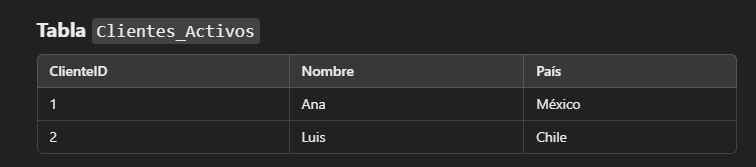
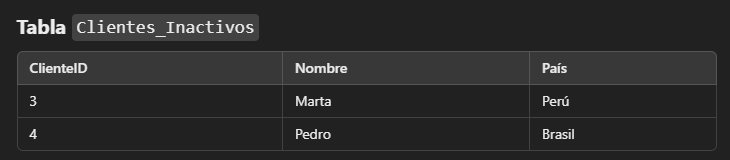

# UNIONs

Te permite combinar filas juntas a diferencia de los `JOINs` que unian una columna al lado de la otra.

## Reglas de UNIONs:

- Tiene que haber el mismo número de columnas en ambas consultas.

- Las columnas deben tener tipos de datos compatibles.

- Por defecto `UNION` elimina duplicados, si quieres mantenerlos usa `UNION ALL`.

### Ejemplos de uso:




Si queremos hacer una lista con los clientes activos e inactivos hacemos uso de `UNION`.

```sql
SELECT ClienteID, Nombre, Pais FROM Clientes_Activos
UNION
SELECT ClienteID, Nombre, Pais FROM Clientes_Inactivos
;
```


Si hay registros repetidos, `UNION` los eliminará, si queremos mantenerlos usamos `UNION ALL`.

```sql
SELECT ClienteID, Nombre, Pais FROM Clientes_Activos
UNION ALL
SELECT ClienteID, Nombre, Pais FROM Cliente_Inactivos
; 
```

- Esto mostrará todos los registros incluyendo duplicados.